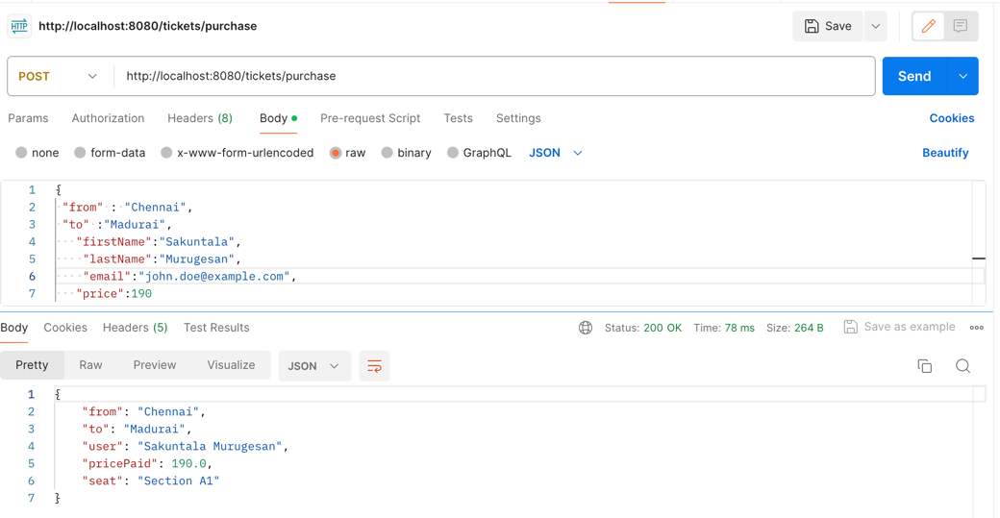
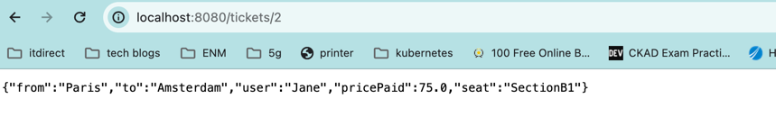
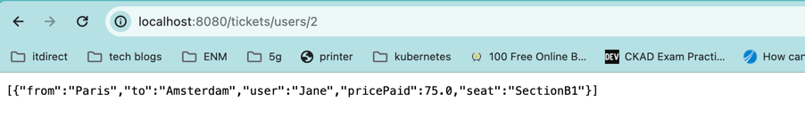
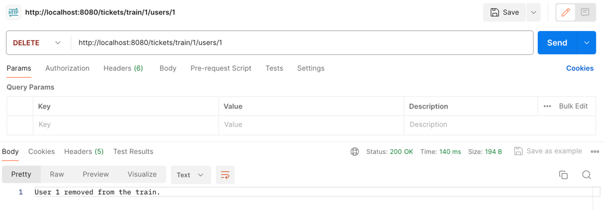
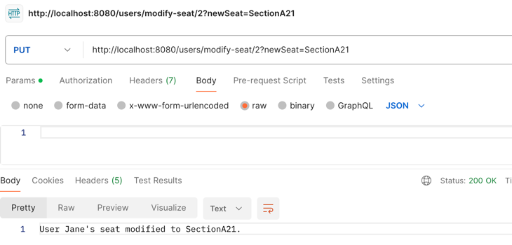

# Train Ticketing System

This project is a train ticketing system that allows users to purchase tickets for a train journey 

## Pre requisities:
1. Groovy installed
2. Intellij build
3. JDK 11 configured

## Entities

### Train

The Train entity represents a train journey from London to France. It includes the following attributes:

- `id`: The unique identifier for the train.
- `name`: The name or description of the train journey.
- `totalSeats`: The total number of seats available on the train.
- `seatsOccupied`: The number of seats currently occupied on the train.

### Ticket

The Ticket entity represents a ticket purchased by a user for the train journey. It includes the following attributes:

- `id`: The unique identifier for the ticket.
- `fromStation`: The station where the journey starts.
- `toStation`: The station where the journey ends.
- `price`: The price paid for the ticket.
- `seat`: The seat allocated to the user on the train.

### User

The User entity represents a user of the train ticketing system. It includes the following attributes:

- `id`: The unique identifier for the user.
- `firstName`: The first name of the user.
- `lastName`: The last name of the user.
- `email`: The email address of the user.
- `seat`: The seat allocated to the user on the train.

## Controller Methods

### Purchase Ticket

- **Endpoint:** `/tickets/purchase`
- **Method:** `POST`
- **Description:** Purchase a ticket for the train journey. Requires providing user details and seat allocation.

### View Ticket Receipt

- **Endpoint:** `/tickets/{ticketId}`
- **Method:** `GET`
- **Description:** View the receipt for a purchased ticket.

### View Receipt by User

- **Endpoint:** `tickets/users/{userId}`
- **Method:** `GET`
- **Description:** Get Receipts by UserId.

### Find User and seats By Section
- **Endpoint:** `/users/seatsection/{sectionName}`
- **Method:** `GET`
- **Description:** Get the user and seat by section

### Remove User from train

- **Endpoint:** `train/{trainId}/users/{userId}`
- **Method:** `DELETE`
- **Description:** Remove a user from the train.

### Modify User Seat

- **Endpoint:** `/users/{userId}/modifySeat`
- **Method:** `PUT`
- **Description:** Modify the seat allocated to a user.

---

